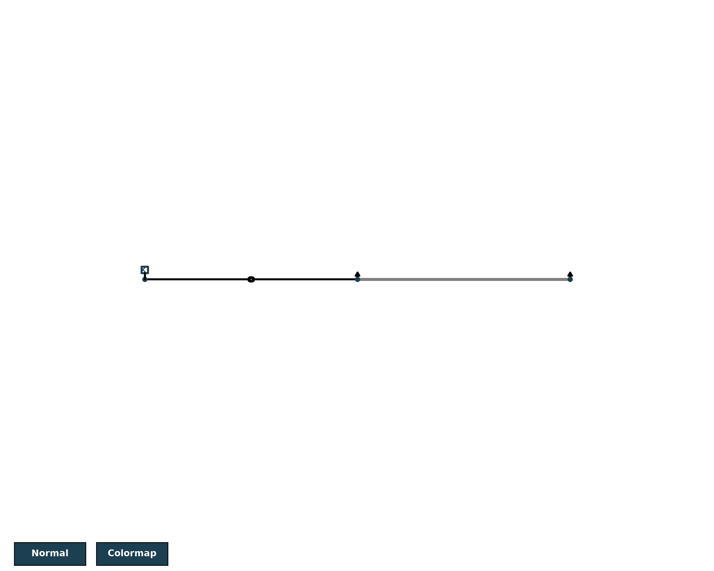
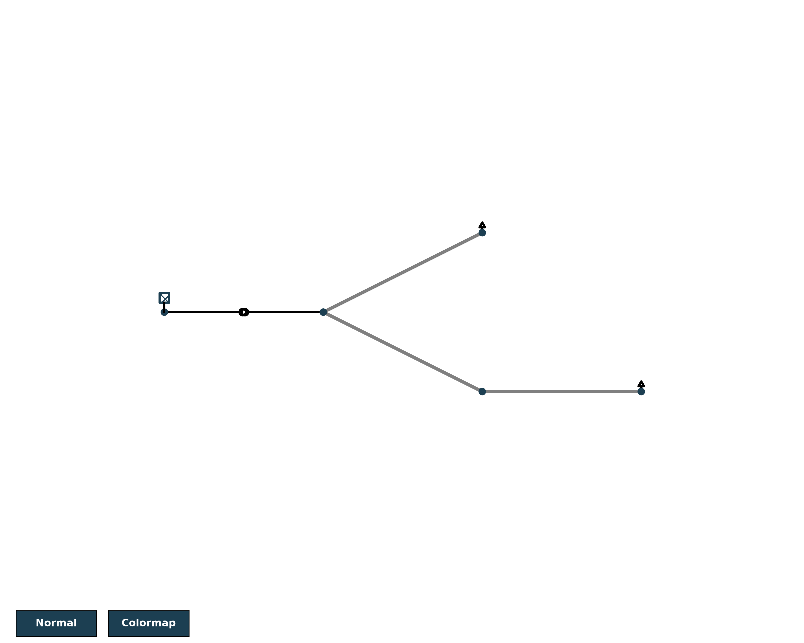

# Power Flow Analysis using Pandapower

## Overview
This project simulates a small electrical distribution network using 
Python and pandapower, then analyzes the results to identify voltage 
issues and equipment loading levels — the same type of analysis 
performed by grid/network engineers at DNOs (Distribution Network 
Operators).

## Network Structure
- **Bus 1 (20 kV)** — Connected to the external grid (power source)
- **Transformer** — Steps voltage down from 20 kV to 0.4 kV
- **Bus 2 (0.4 kV)** — Load Side 1, connected to Load 1 (100 kW)
- **Line 1** — 0.5 km cable connecting Bus 2 to Bus 3
- **Bus 3 (0.4 kV)** — Load Side 2, connected to Load 2 (50 kW)

## Network Diagram


## Key Finding
The power flow simulation revealed that **Bus 3 experiences a voltage 
drop to 86% of nominal (0.86 pu)** — below the acceptable range of 
95-105% typically used in distribution networks. This indicates the 
line connecting Bus 2 to Bus 3 may be undersized or too long for the 
combined load it's carrying, a common real-world issue when extending 
grid connections to new customers.

## Results Summary
| Component | Loading % |
|---|---|
| Transformer | 44.3% |
| Line 1 | 63.6% |

## Tools Used
- Python
- pandapower (network modeling and power flow simulation)
- matplotlib (visualization)

## What I Learned
- How to model buses, transformers, and lines using pandapower's 
  standard component library
- How to interpret power flow results (voltage magnitude, loading %, 
  power losses)
- How to identify voltage violations, a key task in distribution 
  network planning

## Project Structure
```
project-3-power-flow-analysis/
├── power_flow_analysis.py    # Main script — builds and simulates the network
├── requirements.txt          # Python dependencies
├── README.md                 # This file
└── output/
    └── network_diagram.png   # Generated network visualization
```

---

# Version 2: Expanded Branching Network with Contingency & Solar Analysis

## Overview
Building on the initial project, this version expands the network into a 
5-bus branching (radial) distribution circuit and performs deeper analysis: 
identifying voltage violations, testing network resilience through an N-1 
contingency scenario, and evaluating solar generation as a mitigation strategy.

## Network Structure
- **Bus 1 (20 kV)** — Grid connection
- **Transformer** — Steps voltage down from 20 kV to 0.4 kV
- **Bus 2 (0.4 kV)** — Main feeder, splits into two branches
  - **Branch A:** Bus 2 → Line 1 → **Bus 3** (Load 1, 50 kW)
  - **Branch B:** Bus 2 → Line 2 → **Bus 4** (junction) → Line 3 → **Bus 5** (Load 2, 40 kW)



## Finding 1: Voltage Violations
The base simulation revealed two buses with voltage below the acceptable 
95-105% range:

| Bus | Voltage (Base) | Status |
|---|---|---|
| Bus 3 | 89.6% | Below range |
| Bus 5 | 73.8% | Below range (severe) |

Neither the transformer nor any line was overloaded — the issue was purely 
voltage drop caused by cable resistance over distance, not equipment capacity.

## Finding 2: N-1 Contingency Test
To test network resilience, Line 2 (Bus 2–Bus 4) was temporarily disabled 
to simulate a cable failure.

**Result:** Both Bus 4 and Bus 5 lost power entirely (voltage became undefined), 
even though only Bus 4 was directly connected to the failed line. This is 
because Bus 5's only path to the source runs through Bus 4 — demonstrating 
that this radial network has **zero redundancy**: a single line failure can 
cascade and blackout an entire downstream branch.


Line 2 was restored afterward and voltages returned to their original values, 
confirming the model behaves correctly.

## Finding 3: Solar Generation as a Mitigation
30 kW of solar generation was added at Bus 5, then also at Bus 3, to test 
whether local generation could resolve the voltage violations.

| Bus | Before Solar | After Solar | Status |
|---|---|---|---|
| Bus 3 | 89.6% | 95.5% |  Resolved |
| Bus 5 | 73.8% | 93.5% |  Improved, still marginal |

Solar fully resolved Bus 3's violation. Bus 5 improved significantly but 
remained just under the healthy threshold — likely because Bus 5 is 
electrically further from the source, so the same-sized solar addition has 
a smaller relative impact. This suggests Bus 5 may need a larger solar 
installation, a shorter/thicker cable, or a voltage regulator to fully 
resolve the issue.

## Tools Used
- Python, pandapower, matplotlib

## What I Learned
- How to model branching (non-radial-straight) network topologies
- How to perform N-1 contingency analysis, a standard reliability check 
  used by DNOs
- How distributed generation (solar) can mitigate — but not always fully 
  solve — voltage issues, depending on location relative to the source

## Project Structure
```
project-3-power-flow-analysis/
├── power_flow_analysis.py
├── requirements.txt
├── README.md
└── output/
    ├── network_diagram.png                    # Version 1 diagram
    ├── network_diagram_v2.png                 # Version 2 base diagram
    └── network_diagram_v2_line2_failure.png   # N-1 contingency diagram
```